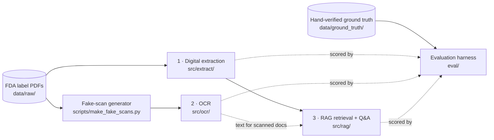

# FDA Label Document Intelligence Pipeline

A document intelligence pipeline for FDA drug labels — digital PDF extraction, OCR benchmarking, and RAG-based question answering — built during a Pfizer-sponsored externship with [Extern](https://www.extern.com). The pipeline is developed and evaluated against **16 real FDA drug labels** (Chantix, Lipitor, Advil, Prevnar 20, Xeljanz, Ibrance, Eliquis, Paxlovid, Zoloft, Norvasc, Viagra, Premarin, Depo-Provera, Zithromax, BeneFIX, and Nurtec ODT), with hand-verified ground truth for every document. The emphasis throughout is on *measured* results: every benchmark number below comes from a reproducible script, every failure was diagnosed to a confirmed mechanism, and the findings documents record what was ruled out, not just what worked.

## Architecture

The pipeline has three stages, each independently runnable and independently evaluated:



1. **Digital PDF extraction** ([src/extract/](src/extract/)) — PyMuPDF text and table extraction plus field parsing keyed on FDA-label anchor phrases ("HIGHLIGHTS OF PRESCRIBING INFORMATION", "Initial U.S. Approval", boxed-warning headers). Includes position-sorted reading-order extraction, because these PDFs' content streams emit text out of visual order (see the RAG finding below). Handles the structured fields: brand/generic name, dosage forms, revision dates, application numbers.

2. **OCR** ([src/ocr/](src/ocr/)) — three engines (Tesseract, PaddleOCR, EasyOCR) behind a shared preprocessing pipeline (`grayscale → deskew → denoise → binarize`, [src/ocr/preprocess.py](src/ocr/preprocess.py)), for label PDFs that arrive as scans with no text layer. Benchmarked head-to-head against ground truth on synthetically degraded "fake scans" ([scripts/make_fake_scans.py](scripts/make_fake_scans.py)) so accuracy is measured, not eyeballed.

3. **RAG retrieval + Q&A** ([src/rag/](src/rag/)) — LlamaIndex + FAISS vector index over section-aware chunks, local HuggingFace embeddings (`bge-base-en-v1.5`), and a **metadata section router** ([src/rag/section_router.py](src/rag/section_router.py)) that maps query phrasing ("boxed warning", "contraindications") to FDA section-header patterns and filters candidates *before* similarity ranking — the fix for the retrieval failure described below.

## Key findings

The two deepest pieces of work in this repo are investigations, each written up in full in [eval/](eval/). Short versions:

### OCR: the confidence metric was lying, and a rotation bug was invisible to 2 of 3 engines

*Full writeup: [eval/OCR_ENGINE_COMPARISON.md](eval/OCR_ENGINE_COMPARISON.md); reproduce with `eval/ocr_benchmark.py`.*

The first anomaly appeared before the benchmark existed: **"clean" documents were scoring *lower* Tesseract confidence than deliberately degraded ones.** Intuitively that's backwards — confidence should track scan quality. Inspecting raw OCR output traced it to formatting, not quality: FDA labels' "RECENT MAJOR CHANGES" sections use dense dot-leader lines (`Warnings and Precautions ......... 5/2024`), and Tesseract misreads the dashed rules as low-confidence garbage pseudo-words (`wane nnn en nnn en nn nn nee ene`), dragging the page average down. Running the same pages through EasyOCR confirmed the mechanism is **Tesseract-specific** — EasyOCR's detector drops the non-text rule lines instead of misreading them. The takeaway generalized: per-engine confidence scores are computed by three different architectures and are not calibrated against each other (PaddleOCR reports higher confidence than Tesseract on every document — e.g. 0.984 vs. 0.882 on Chantix — regardless of actual accuracy), so the benchmark scores against ground truth and treats confidence as directional context only.

That motivated a real scoring harness: 4 documents rasterized into image-only PDFs at varying degradation (down to 110 DPI + skew + blur + JPEG q40), 37 ground-truth fields, sliding-window fuzzy matching for text and strict parsed-date equality for dates.

| Engine | Fields matched | Match rate | Avg. score |
|---|---|---|---|
| PaddleOCR | 31/37 | **83.8%** | 0.876 |
| Tesseract | 30/37 | 81.1% | 0.866 |
| EasyOCR | 30/37 | 81.1% | 0.846 |

The benchmark's third engine earned its keep in an unexpected way. **A shared preprocessing bug — `deskew()` spuriously rotating one document's page 90° sideways off a bad `cv2.minAreaRect` reading — survived two full benchmark runs undetected**, because Tesseract and PaddleOCR are rotation-tolerant enough to read the corrupted image anyway. EasyOCR is not: its 0/9 (0%) score on Ibrance is what surfaced the bug. The fix clamps `deskew()` to skip any computed correction above 15° (real skew in this dataset tops out at 2.5°). Every individual miss in the benchmark was likewise inspected and attributed — e.g. the one genuine engine difference: Tesseract's LSTM reads Chantix's dosage line "Tablets: 0.5 mg and 1 mg" as `0.5mgandimg` (digit "1" → letter "i"), while PaddleOCR reads it perfectly, which is exactly the class of error that matters most on pharmaceutical labels.

**Outcome:** PaddleOCR recommended as the pipeline's primary engine — it ties or wins everywhere, and its built-in text-angle classifier is structural insurance against the deskew failure class.

### RAG: a near-random ranking that no better embedding could fix

*Full writeups: [eval/RAG_ROUTING_FINDINGS.md](eval/RAG_ROUTING_FINDINGS.md) and [eval/EMBEDDING_MODEL_COMPARISON.md](eval/EMBEDDING_MODEL_COMPARISON.md); the experiment log itself is preserved in [src/rag/section_router.py](src/rag/section_router.py).*

Asking a default-chunked index *"what is the boxed warning about?"* returned the wrong chunk at rank #1 — by a score margin of **0.0037**, essentially a coin flip. Three hypotheses were tested sequentially and ruled out:

1. **Chunk heterogeneity** — maybe the correct chunk mixed too many topics for its embedding to represent any of them. Re-chunking at FDA section-header boundaries so the boxed warning got its own isolated chunk *didn't fix it*: CONTRAINDICATIONS still edged out WARNING, 0.6776 vs. 0.6718.
2. **Chunk length bias** — maybe short chunks systematically outscore long ones. Length-vs-score correlation measured across every retrieval call: too weak and inconsistent to explain the ranking.
3. **Embedding-model quirk** — maybe it was a `bge-base` artifact. Swapping to MiniLM (different architecture, 384 vs. 768 dims) reproduced the failure *worse* — the correct chunk dropped out of the top 3 entirely.

The surviving explanation is a **vocabulary mismatch that no embedding model can bridge**: "boxed warning" is regulatory metadata language, while the warning's actual text speaks entirely in clinical terms (agitation, suicidality, neuropsychiatric events). There is nothing for similarity to latch onto. But FDA section headers are a small, fixed, predictable vocabulary — so this is a lookup problem, not a ranking problem. The fix is a **metadata section router**: map query phrases to section-header patterns (`"boxed warning"` → `^WARNING:`), filter candidates to matching sections first, and only then rank by similarity.

Extending the router from 1 to 14 documents surfaced and fixed two more chunking defects (a lettered boxed-warning title that fell outside the header regex, and header-shaped wrap lines that silently emptied a warning chunk's body — each fix regression-checked against all 16 documents). A held-out 14-question eval, locked before the first run, then produced the most useful number in the project:

| Metric | First run | After extraction fix |
|---|---|---|
| Section routing correctness | 14/14 = 100% | 14/14 = 100% |
| End-to-end accuracy@1 | **5/14 = 36%** | **14/14 = 100%** |

The gap in the first run's numbers *was* the finding. All 9 failures were individually verified: the expected text existed in the corpus (fuzzy match ≥ 0.99) but sat in the *wrong chunk* — the router routed correctly to a section whose content had been displaced upstream, and hit@3 equaled hit@1, so no amount of better ranking could recover it. The bottleneck was chunk *assembly* at extraction time.

The assumed cause — two-column layout interleaving — turned out to be wrong, which is why the fix started by rendering the failing pages and tracing them by eye before touching code. A corpus-wide layout scan showed **every page is single-column**; the real mechanism is **PDF content-stream order**: these SPL-generated PDFs emit section headers and bullet glyphs first and append the bullet body text at the stream's end, so stream-order extraction (both pypdf and unsorted PyMuPDF) places content under the wrong header. The scan also explained why development never caught it: CHANTIX — the document the pipeline was built against — is the *only* document in the corpus with zero out-of-order lines. The fix is position-sorted, reading-order extraction ([src/extract/pymupdf_extractor.py](src/extract/pymupdf_extractor.py)). Its one regression was itself instructive: ELIQUIS's table of contents repeats the boxed-warning title, which became a content-free 63-character chunk that *outranked* the real 879-character warning chunk (0.6931 vs. 0.6355 cosine) — so the chunker now drops header-only chunks, since a chunk with no content can only steal rank, never answer. Final result: 14/14 on the locked eval set, with every noise-chunk change during the regression check traced to a confirmed mechanism.

## Ground truth & data integrity

All 16 documents have hand-verified ground truth ([data/ground_truth/](data/ground_truth/)) — one JSON per label covering identity fields, revision dates, boxed-warning status, indications, and dosage strengths, each with a `notes` field recording per-document ambiguities (dual PI/SPL revision dates, BLA-vs-NDA licensing, OTC "Drug Facts" vs. prescription formats).

Verification wasn't a formality — it caught three real data-integrity bugs, each documented with a `CORRECTED:` entry in the affected file:

- **Cross-document contamination** — Lipitor's revision date had been transcribed as 4/2023, spliced in from *Prevnar 20's* date via misread truncated terminal output. All three "Revised:" occurrences in the actual document say 4/2024.
- **A fabricated field** — Prevnar 20's dosage form originally said "single-dose vial/prefilled syringe"; the source text describes no vial presentation at all.
- **A paraphrase standing in for data** — Xeljanz's dosage strengths field named the formulations but contained zero actual strengths; every mg value was re-extracted and individually verified against the source (5/10 mg tablets, 11/22 mg XR, 1 mg/mL solution).

## Tech stack

| Layer | Tools |
|---|---|
| Language / runtime | Python 3.11 |
| PDF extraction | PyMuPDF |
| OCR | Tesseract (pytesseract), PaddleOCR (PaddlePaddle), EasyOCR, OpenCV, Pillow |
| RAG / retrieval | LlamaIndex, FAISS (`faiss-cpu`), sentence-transformers (`BAAI/bge-base-en-v1.5` default; MiniLM benchmarked as alternative) |
| LLMs | Google Gemini (RAG answer synthesis), Mistral AI and HF Transformers/PyTorch (Phi-2) clients for model comparison |
| API / serving | FastAPI, Uvicorn, Pydantic *(scaffolded — see below)* |
| Infra | Docker, docker-compose (API + worker + Redis) |
| Evaluation | scikit-learn, rouge-score, custom fuzzy-match scoring harness |
| Testing | pytest |

## Setup & how to run

1. **Clone and create an environment** (Python 3.11):

   ```bash
   git clone <repo-url> && cd pfizer-doc-intelligence
   python -m venv .venv && source .venv/bin/activate   # Windows: .venv\Scripts\activate
   pip install -r requirements.txt
   ```

   The Tesseract *binary* is a separate system install (`apt install tesseract-ocr`, `choco install tesseract`, or `brew install tesseract`). PaddlePaddle and the three OpenCV packages are deliberately pinned — see the comments in [requirements.txt](requirements.txt) before changing versions.

2. **Configure environment variables:**

   ```bash
   cp .env.example .env
   ```

   `GEMINI_API_KEY` is required for the RAG query engine; `MISTRAL_API_KEY` and `HF_TOKEN` are only needed for the LLM model-comparison modules.

3. **Add source documents** — place FDA label PDFs in `data/raw/`, named by DailyMed SPL convention (`YYYYMMDD_<set-id>.pdf`). Ground-truth files in `data/ground_truth/` are matched by filename stem.

4. **Run the stages individually** (from the repo root — the `src.` imports need the root on `PYTHONPATH`; PowerShell: `$env:PYTHONPATH = "."`):

   ```bash
   # Generate image-only "fake scan" PDFs for OCR benchmarking
   python scripts/make_fake_scans.py

   # OCR three-engine benchmark  →  eval/results/ocr_benchmark.json
   PYTHONPATH=. python eval/ocr_benchmark.py

   # RAG section-router experiment log (requires GEMINI_API_KEY)
   PYTHONPATH=. python src/rag/section_router.py

   # Held-out RAG retrieval eval  →  eval/results/rag_retrieval_eval.json
   python eval/rag_retrieval_eval.py
   ```

5. **API** — a FastAPI service and docker-compose stack (API + Redis + worker) are scaffolded ([api/](api/), [docker-compose.yml](docker-compose.yml)) but the routes are not yet implemented; the pipeline stages currently run as the standalone scripts above.

## Project structure

```
pfizer-doc-intelligence/
├── api/            # FastAPI service scaffolding (routes not yet implemented)
├── data/
│   ├── raw/           # Source FDA label PDFs (gitignored)
│   ├── raw_scanned/   # Generated image-only "fake scan" PDFs + manifest
│   ├── ground_truth/  # Hand-verified per-document ground truth JSON
│   └── ocr_output/    # Raw OCR engine output
├── eval/           # Benchmarks, scoring harness, locked eval sets, findings writeups
├── scripts/        # Fake-scan PDF generator
├── src/
│   ├── extract/    # PyMuPDF text/table extraction + FDA field parsing
│   ├── ocr/        # Tesseract / PaddleOCR / EasyOCR engines + shared preprocessing
│   ├── rag/        # Chunking, embeddings, FAISS index, section router, query engine
│   ├── llm/        # Mistral / Gemini / Phi-2 clients + model comparison
│   └── classify/   # Document boundary detection + metadata tagging
├── Dockerfile
├── docker-compose.yml
└── requirements.txt
```
